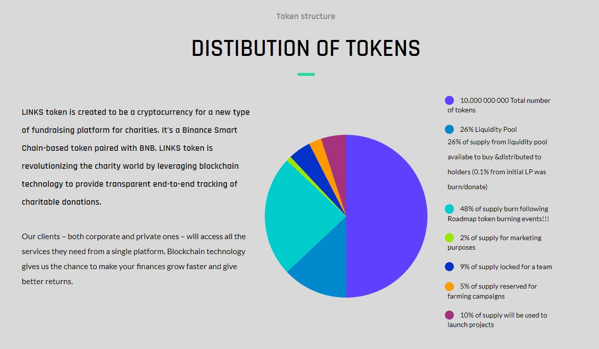

# Tokenomics

## 10.000.000.000 Total number of tokens

26% of supply from liquidity pool availabe to buy & distributed to holders

48% of supply burnt following Roadmap token burning events !!!

2% of supply for marketing purposes

9% of supply locked for a team

10% of supply will be used to donate

5% of supply reserved for farming campaigns !!!

### LINKS Protocol

**Fee  7% total**

2% of fee of every transaction is paid out to existing holders (redistribution)

2% for donation

1% for marketing

1% for linksfoundation

1% of fee for liquidity ( complements LP )
